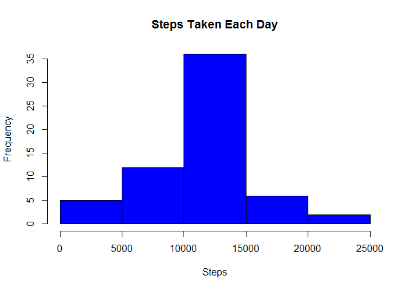
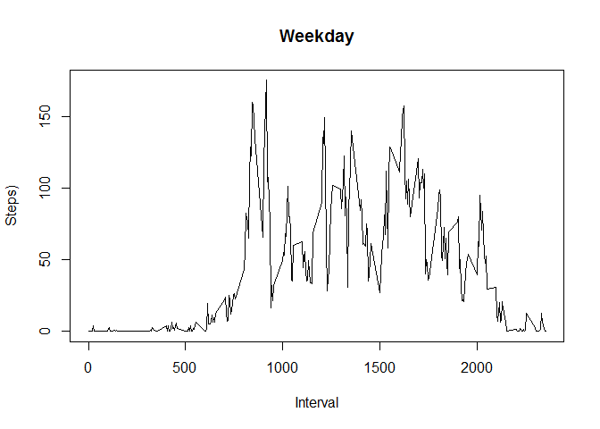
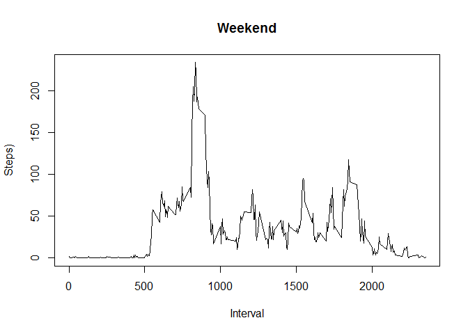

# Reproducible Research: Peer Assessment 1
## Loading and preprocessing the data


```r
library(dplyr)
```

```
## 
## Attaching package: 'dplyr'
```

```
## The following objects are masked from 'package:stats':
## 
##     filter, lag
```

```
## The following objects are masked from 'package:base':
## 
##     intersect, setdiff, setequal, union
```

```r
setwd("C:/Users/J Sylus")
data <- read.csv(unz("repdata-2Fdata-2Factivity.zip", "activity.csv"),header=T,stringsAsFactors=T, sep=",")
data$date <- as.Date(data[,2],format="%Y-%m-%d")
attach(data)
```

## What is mean total number of steps taken per day?


```r
data_nona <- data[complete.cases(data),]
day_sum <-summarise(group_by(data_nona,date),steps=sum(steps))
interval_sum <- summarise(group_by(data_nona,interval),steps=mean(steps))
hist(day_sum$steps,main="Steps Taken Each Day",col="blue",xlab="Steps")
```

<!-- -->

```r
mean(day_sum$steps)
```

```
## [1] 10766.19
```

```r
median(day_sum$steps)
```

```
## [1] 10765
```

## What is the average daily activity pattern?


```r
with(interval_sum,plot(interval,steps,type="l",ylab="Steps)",xlab="Interval",main="Activity Pattern"))
```

<!-- -->

```r
interval_sum[interval_sum$steps==max(interval_sum$steps),]
```

```
## # A tibble: 1 × 2
##   interval    steps
##      <int>    <dbl>
## 1      835 206.1698
```

## Imputing missing values


```r
data_impute <- data
day_means <-summarise(group_by(data_nona,date),steps=mean(steps))
data_impute$steps[is.na(data_impute$steps)] <- mean(data_nona$steps)
data_impute_sum <-summarise(group_by(data_impute,date),steps=sum(steps))

mean(data_impute_sum$steps)
```

```
## [1] 10766.19
```

```r
median(data_impute_sum$steps)
```

```
## [1] 10766.19
```

```r
hist(data_impute_sum$steps,main="Steps Taken Each Day",col="blue",xlab="Steps")
```

<!-- -->

## Are there differences in activity patterns between weekdays and weekends?

```r
data_nona$weekday <- weekdays(data_nona$date)
data_nona$weekdayfact[data_nona$weekday %in% c("Monday","Tuesday","Wednesday","Thursday","Friday")] <-1
data_nona$weekdayfact[data_nona$weekday %in% c("Saturday","Sunday")] <-0
weekdayfact_means <-summarise(group_by(data_nona,interval,weekdayfact),steps=mean(steps))
weekdayplot_means <- subset(weekdayfact_means, weekdayfact_means$weekdayfact==0)
weekendplot_means <- subset(weekdayfact_means, weekdayfact_means$weekdayfact==1)
with(weekdayplot_means,plot(interval,steps,type="l",ylab="Steps)",xlab="Interval",main="Weekday"))
```

<!-- -->

```r
with(weekendplot_means,plot(interval,steps,type="l",ylab="Steps)",xlab="Interval",main="Weekend"))
```

<!-- -->

